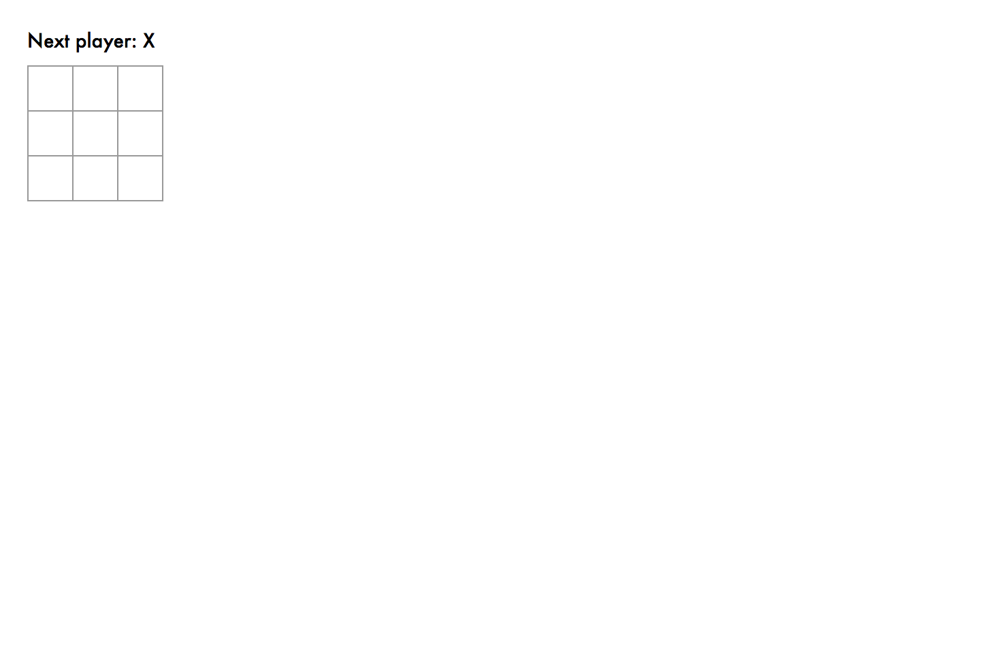

# README

Rails 5.1 の webpack を利用して [React Tutorial](https://facebook.github.io/react/tutorial/tutorial.html)（執筆時点では Tic Tac Toe）を実行するまでの手順を説明したリポジトリです。

- React Tutorial: [英語](https://facebook.github.io/react/tutorial/tutorial.html), [有志による日本語訳](https://mae.chab.in/archives/2943)

## 事前準備

- ruby, rails 5.1 以上のインストール
- node, yarn のインストール

## 手順

### 1. ワークディレクトリを作成する

ワークディレクトリとして `rails5.1-react-tutorial` を作成します。

```
$ mkdir rails5.1-react-tutorial
$ cd rails5.1-react-tutorial
```

### 2. Rails を初期化する

次のコマンドを実行して Rails を初期化します。

```
$ rails new . --webpack=react --skip-spring
```

好みの問題ですが `--skip-spring` をつけて初期化しています。

### 3. コントローラーを作成する

React Tutorial 用のコントローラーを作成します。
React Tutorial では、Tic Tac Toe というゲームを開発するので、`game` コントローラーと `index`  アクションを作成します。

```
$ bin/rails g controller game index
```

### 4. routes.rb を修正

`config/routes.rb` を修正し、ブラウザでアクセスした際に、`game` コントローラーと `index`  アクションを表示するようにします。

`config/routes.rb` をテキストエディタで開き、中身を次のようにします。

```
Rails.application.routes.draw do
  root to: 'game#index'
end
```

### 5. React Tutorial の Starter Code をコピペする

React Tutorial の [Starter Code](https://codepen.io/gaearon/pen/oWWQNa?editors=0010) をブラウザで開きコピペします。

#### CSS

まずは CSS をコピペします。
`app/stylesheet/geme_react.scss` という名前でファイルを作成します。

```
body {
  font: 14px "Century Gothic", Futura, sans-serif;
  margin: 20px;
}

ol, ul {
  padding-left: 30px;
}

.board-row:after {
  clear: both;
  content: "";
  display: table;
}

.status {
  margin-bottom: 10px;
}

.square {
  background: #fff;
  border: 1px solid #999;
  float: left;
  font-size: 24px;
  font-weight: bold;
  line-height: 34px;
  height: 34px;
  margin-right: -1px;
  margin-top: -1px;
  padding: 0;
  text-align: center;
  width: 34px;
}

.square:focus {
  outline: none;
}

.kbd-navigation .square:focus {
  background: #ddd;
}

.game {
  display: flex;
  flex-direction: row;
}

.game-info {
  margin-left: 20px;
}
```

#### JS

次に JS をコピペします。
`app/javascript/packs/game_react.jsx` という名前でファイルを作成します。

コピペする際に、本プロジェクト向けに次の点を改変します。

- 先頭2行で React, ReactDOM をインポート
- 3 行目に上で作成した CSS への参照の追加
- ファイルの末尾で、`ReactDOM.render` を `document.addEventListener('DOMContentLoaded', () => {` で囲む

改変後の JS は次のようになります。

```
import React from 'react';
import ReactDOM from 'react-dom';
require('../../stylesheet/game_react.scss');

// 以下、Starter Code をコピペ
class Square extends React.Component {
  render() {
    return (
      <button className="square">
        {/* TODO */}
      </button>
    );
  }
}

class Board extends React.Component {
  renderSquare(i) {
    return <Square />;
  }

  render() {
    const status = 'Next player: X';

    return (
      <div>
        <div className="status">{status}</div>
        <div className="board-row">
          {this.renderSquare(0)}
          {this.renderSquare(1)}
          {this.renderSquare(2)}
        </div>
        <div className="board-row">
          {this.renderSquare(3)}
          {this.renderSquare(4)}
          {this.renderSquare(5)}
        </div>
        <div className="board-row">
          {this.renderSquare(6)}
          {this.renderSquare(7)}
          {this.renderSquare(8)}
        </div>
      </div>
    );
  }
}

class Game extends React.Component {
  render() {
    return (
      <div className="game">
        <div className="game-board">
          <Board />
        </div>
        <div className="game-info">
          <div>{/* status */}</div>
          <ol>{/* TODO */}</ol>
        </div>
      </div>
    );
  }
}

// ========================================

document.addEventListener('DOMContentLoaded', () => {
  ReactDOM.render(
    <Game />,
    document.getElementById('root')
  );
});
```

#### HTML

最後に HTML をコピペします。
`game` コントローラーの `index` アクションの view ファイル `app/views/game/index.html.erb   ` を修正します。

コピペする際に、先頭2行を次のようにし、上で作成した `game_react.scss` と `game_react.jsx` との参照を追加します。
なお、`game_react.scss` と `game_react.jsx` とは、webpacker によりトランスパイルされ、実際には`game_react.css` と `game_react.js` に変換されたものが参照されます。

```
<%= javascript_pack_tag 'game_react' %>
<%= stylesheet_pack_tag 'game_react' %>

<!-- 以下、Starter Code をコピペ -->
<div id="errors" style="
  background: #c00;
  color: #fff;
  display: none;
  margin: -20px -20px 20px;
  padding: 20px;
  white-space: pre-wrap;
"></div>
<div id="root"></div>
<script>
window.addEventListener('mousedown', function(e) {
  document.body.classList.add('mouse-navigation');
  document.body.classList.remove('kbd-navigation');
});
window.addEventListener('keydown', function(e) {
  if (e.keyCode === 9) {
    document.body.classList.add('kbd-navigation');
    document.body.classList.remove('mouse-navigation');
  }
});
window.addEventListener('click', function(e) {
  if (e.target.tagName === 'A' && e.target.getAttribute('href') === '#') {
    e.preventDefault();
  }
});
window.onerror = function(message, source, line, col, error) {
  var text = error ? error.stack || error : message + ' (at ' + source + ':' + line + ':' + col + ')';
  errors.textContent += text + '\n';
  errors.style.display = '';
};
console.error = (function(old) {
  return function error() {
    errors.textContent += Array.prototype.slice.call(arguments).join(' ') + '\n';
    errors.style.display = '';
    old.apply(this, arguments);
  }
})(console.error);
</script>
```

### 6. 起動

コンソールを開き、次のコマンドを実行します。

```
$ bin/rails s
```

別のコンソールを開き、次のコマンドも実行します。

```
$ bin/webpack-dev-server
```

ブラウザで `http://localhost:3000/` へアクセスします。
次の画面が表示されれば成功です。



### 7. その後

React Tutorial を最後まで進めてみてください。
